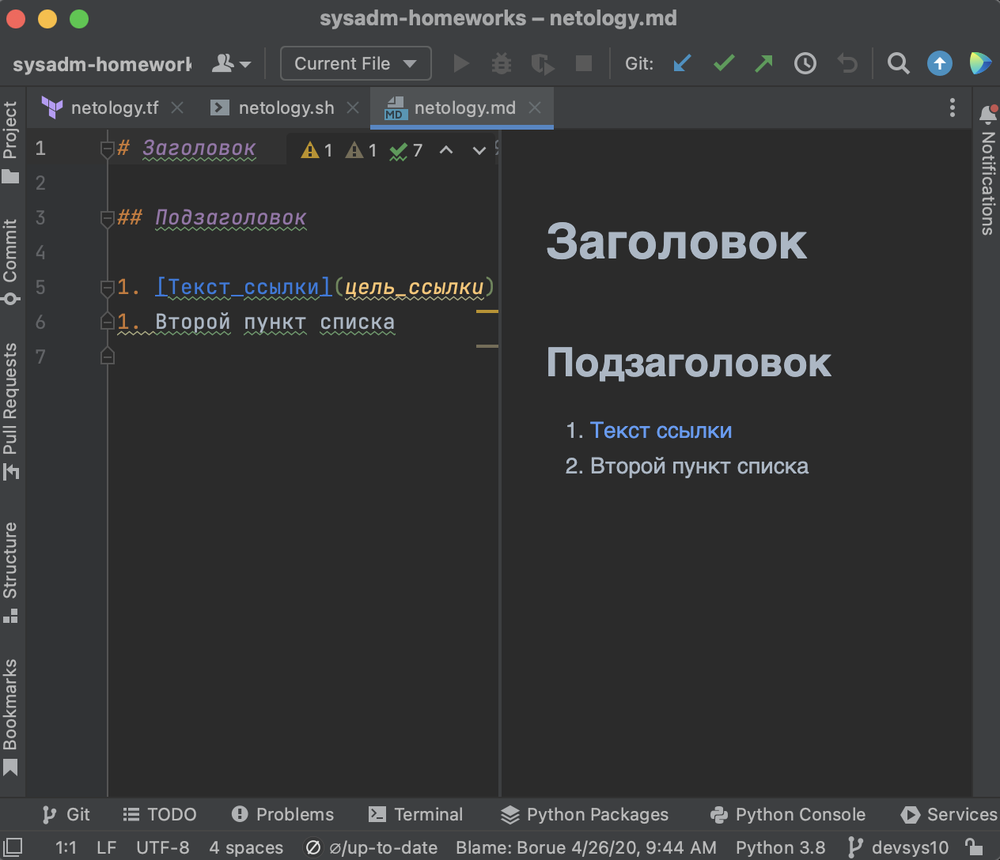

# Введение в DevOps
## Задание 1. Подготовка рабочей среды

- Список установленных плагинов:

- Bash-файл:

- Jsonnet-файл:

- Terraform-файл:

- YAML-файл:

- Markdown-файл:

## Задание 2. Описание жизненного цикла задачи (разработки нового функционала)

- Планирование нового функционала:
  - Постановка общей задачи -> Менеджер
  - Заведение подзадач в JIRA -> Разработчики, DevOps, Тестировщики
  - Распределение подзадач между сотрудниками (assignee) -> Менеджер
  - Установка затрачиваемого времени (estimated) и сложности (story points) подзадач -> Менеджер

- Подготовка инфраструктуры для реализации нового функционала:
  - Определение необходимого железа для CI/CD -> Менеджер, Разработчики, Тестировщики, DevOps
  - Выбор единого стека используемых инструментов/сервисов (Gitlab/Bitbucket, Jenkins/Travis и т.д.) -> Менеджер, Разработчики, Тестировщики, DevOps
  - Разворачивание и настройка CI/CD инструментов -> DevOps
  - Развертывание системы хранения артефактов, резервного копирования -> DevOps

- Разработка нового функционала:
  - Написание кодовой части нового функционала -> Разработчики

- Тестирование нового функционала:
  - Разработка тестов для элементов нового функционала -> Тестировщики
  - Внедрение автоматических тест-систем на CI/CD -> Тестировщики, DevOps
  - Привязка автоматических тест-систем к репозиториям разработчиков, настройка триггеров их запуска -> Разработчики, Тестировщики, DevOps

- Управление процессом разработки:
  - Проведение ежедневного team sync с апдейтами по подзадачам -> Менеджер, Разработчики, Тестировщики, DevOps
  - Еженедельное приемочное тестирование нового функционала -> Менеджер
  - (При необходимости) Откат на стабильную версию проекта -> DevOps

- Выгрузка нового функционала:
  - Деплой обновленной версии интернет-магазина с новым функционалом -> DevOps